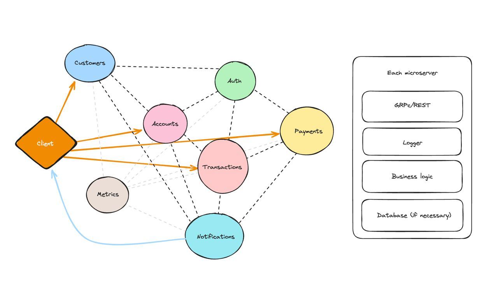

# Microservices bank
## Description
This is project is a microservices bank pet project, where you can create an account, deposit money, withdraw money, transfer money and check your balance. This project is a simple example of how microservices work. The project is divided into microservices.

## Stack
### Languages
- Java and C#

### Frameworks
- Spring Boot
- .NET Core
- gRPC

### Databases
- PostgreSQL
- Redis

### CI/CD/Cloud
- Docker
- Kubernetes
- Jenkins
- Terraform

### Metrics
- RabbitMQ
- Prometheus
- Grafana
- Kafka

### Security
- JWT
- OAuth2
- Keycloak

## Architecture

### Microservices
1. Auth
2. Notification
3. Payment
4. Accounts
5. Customers
6. Transactions
7. Metrics

#### 1.Auth
This is service of authentication and authorization. This service is responsible for generating JWT tokens and validating them. This service is also responsible for validating the user's credentials.

#### 2.Notification
This service is responsible for sending notifications to the user. This service is responsible for sending emails, sms and push notifications.

#### 3.Payment
This service is responsible for processing payments. This service is responsible for processing payments by credit card, debit card, bank slip and PIX.

#### 4.Accounts
This service is responsible for managing accounts. This service is responsible for creating accounts, updating accounts, deleting accounts and checking account balances.

#### 5.Customers
This service is responsible for managing customers. This service is responsible for creating customers, updating customers, deleting customers and checking customer information.

#### 6.Transactions
This service is responsible for managing transactions. This service is responsible for creating transactions, updating transactions, deleting transactions and checking transaction information.

#### 7.Metrics
This service is responsible for monitoring the system. This service is responsible for monitoring the system and generating metrics.

## Contributors
- [Hlib Arseniuk](https://github.com/Glebegor)
- [Vladyslav Arseniuk](https://github.com/Arsen290)